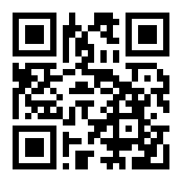
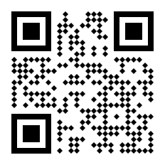
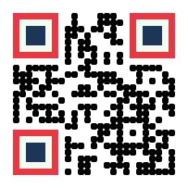
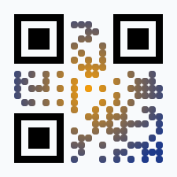
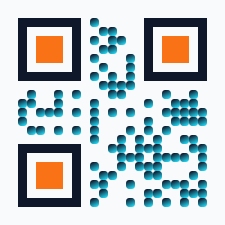
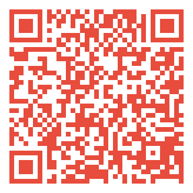
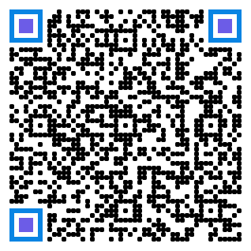
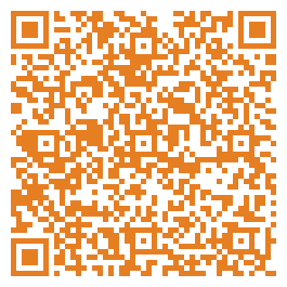

<p align="center">
  
</p>

<h1 align="center">Qiroex</h1>

<p align="center">
  <strong>A pure-Elixir QR code generator — zero dependencies, full spec, beautiful output.</strong>
</p>

<p align="center">
  <a href="#installation">Installation</a> · <a href="#quick-start">Quick Start</a> · <a href="#styling">Styling</a> · <a href="#logo-embedding">Logos</a> · <a href="#payload-builders">Payloads</a> · <a href="#api-reference">API</a>
</p>

---

Qiroex generates **valid, scannable QR codes** entirely in Elixir with no external dependencies — no C NIFs, no system libraries, no ImageMagick. It implements the full **ISO 18004** specification and outputs to **SVG**, **PNG**, and **terminal**.

## Features

- **Zero dependencies** — pure Elixir, runs anywhere the BEAM runs
- **Full QR spec** — versions 1–40, error correction L/M/Q/H, all 4 encoding modes (numeric, alphanumeric, byte, kanji), 8 mask patterns
- **Three output formats** — SVG (vector), PNG (raster), terminal (Unicode art)
- **Visual styling** — module shapes (circle, rounded, diamond), custom colors, gradients, finder pattern colors
- **Logo embedding** — embed SVG logos in the center with automatic coverage validation
- **11 payload builders** — WiFi, URL, Email, SMS, Phone, Geo, vCard, vEvent, MeCard, Bitcoin, WhatsApp
- **Input validation** — descriptive error messages for every misconfiguration
- **Thoroughly tested** — 500+ unit and integration tests

## Installation

Add `qiroex` to your list of dependencies in `mix.exs`:

```elixir
def deps do
  [
    {:qiroex, "~> 0.1.0"}
  ]
end
```

Then run `mix deps.get`.

## Quick Start

### Generate and save an SVG

```elixir
Qiroex.save_svg("https://example.com", "qr.svg")
```



### Generate and save a PNG

```elixir
Qiroex.save_png("https://example.com", "qr.png")
```

### Print to terminal

```elixir
Qiroex.print("Hello from Qiroex!")
```

### Work with raw data

```elixir
# Get an SVG string
{:ok, svg} = Qiroex.to_svg("Hello")

# Get a PNG binary
{:ok, png} = Qiroex.to_png("Hello")

# Get a QR struct for inspection
{:ok, qr} = Qiroex.encode("Hello")
Qiroex.info(qr)
# => %{version: 1, ec_level: :m, mode: :byte, mask: 4, modules: 21, data_bytes: 5}

# Get the raw 0/1 matrix
{:ok, matrix} = Qiroex.to_matrix("Hello")
```

## Encoding Options

Control the encoding process with these options (available on all functions):

```elixir
# Error correction level (:l, :m, :q, :h)
Qiroex.save_svg("Hello", "qr.svg", level: :h)

# Force a specific version (1–40)
Qiroex.save_svg("Hello", "qr.svg", version: 5)

# Force encoding mode
Qiroex.save_svg("12345", "qr.svg", mode: :numeric)

# Force mask pattern (0–7)
Qiroex.save_svg("Hello", "qr.svg", mask: 2)

# Combine freely
Qiroex.save_svg("Hello", "qr.svg", level: :q, version: 3, mask: 0)
```

## Render Options

### SVG Options

```elixir
Qiroex.save_svg("Hello", "qr.svg",
  module_size: 12,             # pixel size of each module (default: 10)
  quiet_zone: 2,               # modules of white border (default: 4)
  dark_color: "#4B275F",       # any CSS color
  light_color: "#F4F1F6"       # background color
)
```


### PNG Options

```elixir
Qiroex.save_png("Hello", "qr.png",
  module_size: 20,                   # pixel size per module (default: 10)
  quiet_zone: 3,                     # quiet zone modules (default: 4)
  dark_color: {75, 39, 95},          # {r, g, b} tuple, 0–255
  light_color: {244, 241, 246}       # background color
)
```

## Styling

Qiroex supports rich visual customization through the `Qiroex.Style` struct. All style options apply to **SVG output**; PNG supports finder pattern colors.

### Module Shapes

Choose how individual data modules are rendered:

```elixir
# Circular dots
style = Qiroex.Style.new(module_shape: :circle)
Qiroex.save_svg("Hello", "circles.svg", style: style)

# Rounded squares
style = Qiroex.Style.new(module_shape: :rounded, module_radius: 0.4)
Qiroex.save_svg("Hello", "rounded.svg", style: style)

# Diamond (rotated squares)
style = Qiroex.Style.new(module_shape: :diamond)
Qiroex.save_svg("Hello", "diamond.svg", style: style)
```

<table>
  <tr>
    <td align="center"><br /><code>:circle</code></td>
    <td align="center"><br /><code>:rounded</code></td>
    <td align="center"><br /><code>:diamond</code></td>
  </tr>
</table>

### Finder Pattern Colors

Customize the three concentric layers of each finder pattern independently:

```elixir
style = Qiroex.Style.new(
  module_shape: :rounded,
  module_radius: 0.3,
  finder: %{
    outer: "#E63946",    # 7×7 dark border ring
    inner: "#F1FAEE",    # 5×5 light ring
    eye:   "#1D3557"     # 3×3 dark center
  }
)

Qiroex.save_svg("Hello", "finder.svg", style: style)
```



### Gradient Fills

Apply linear or radial gradients to dark modules:

```elixir
# Linear gradient at 135°
style = Qiroex.Style.new(
  module_shape: :circle,
  gradient: %{
    type: :linear,
    start_color: "#667EEA",
    end_color: "#764BA2",
    angle: 135
  }
)

Qiroex.save_svg("Hello", "gradient.svg", style: style)
```

<table>
  <tr>
    <td align="center"><br />Linear</td>
    <td align="center"><br />Radial</td>
    <td align="center"><br />Combined</td>
  </tr>
</table>

### Kitchen Sink

Combine everything for maximum visual impact:

```elixir
style = Qiroex.Style.new(
  module_shape: :circle,
  finder: %{outer: "#2D3436", inner: "#FFFFFF", eye: "#E17055"},
  gradient: %{type: :linear, start_color: "#2D3436", end_color: "#636E72", angle: 45}
)

Qiroex.save_svg("https://elixir-lang.org", "styled.svg", style: style)
```

## Logo Embedding

Embed an SVG logo in the center of your QR code. Qiroex automatically clears the modules behind the logo area and validates that the logo doesn't exceed the error correction capacity.

```elixir
logo = Qiroex.Logo.new(
  svg: ~s(<svg viewBox="0 0 100 100">
    <circle cx="50" cy="50" r="40" fill="#9B59B6"/>
    <text x="50" y="62" text-anchor="middle" font-size="36"
          font-weight="bold" fill="white" font-family="sans-serif">Ex</text>
  </svg>),
  size: 0.22,          # 22% of QR code size
  shape: :circle,      # background shape (:square, :rounded, :circle)
  padding: 1           # padding in modules around the logo
)

# Use high EC level (:h) for best scan reliability with logos
Qiroex.save_svg("https://elixir-lang.org", "logo.svg", level: :h, logo: logo)
```

<table>
  <tr>
    <td align="center"><br />Basic + Logo</td>
    <td align="center"><br />Styled + Logo</td>
  </tr>
</table>

### Logo + Style

Logos work seamlessly with all styling options:

```elixir
style = Qiroex.Style.new(
  module_shape: :rounded,
  module_radius: 0.3,
  finder: %{outer: "#4B275F", inner: "#FFFFFF", eye: "#9B59B6"}
)

Qiroex.save_svg("https://elixir-lang.org", "branded.svg",
  level: :h, style: style, logo: logo)
```

### Logo Options

| Option | Default | Description |
|--------|---------|-------------|
| `:svg` | *required* | SVG markup string for the logo |
| `:size` | `0.2` | Logo size as fraction of QR code (0.0–0.4) |
| `:padding` | `1` | Padding around logo in modules |
| `:background` | `"#ffffff"` | Background color behind the logo |
| `:shape` | `:square` | Background shape: `:square`, `:rounded`, `:circle` |
| `:border_radius` | `4` | Corner radius for `:rounded` shape |

### Coverage Validation

Qiroex automatically validates that the logo doesn't cover too many modules. If the logo is too large for the chosen error correction level, you'll get a clear error message:

```elixir
large_logo = Qiroex.Logo.new(svg: "<svg/>", size: 0.4)

{:error, message} = Qiroex.to_svg("Hello", level: :l, logo: large_logo)
# => "Logo covers 28.3% of modules, but EC level :l safely supports only 5.6%.
#     Use a higher EC level or a smaller logo size."
```

> **Tip:** Always use error correction level `:h` when embedding logos for maximum scan reliability.

## Payload Builders

Generate structured data payloads for common QR code use cases with a single function call:

```elixir
# WiFi network — scan to connect
{:ok, svg} = Qiroex.payload(:wifi,
  [ssid: "CoffeeShop", password: "latte2024"],
  :svg, dark_color: "#2C3E50")
```

Qiroex ships with **11 payload builders** covering the most common QR code use cases:

### WiFi

Scan to auto-connect to a network.

```elixir
{:ok, svg} = Qiroex.payload(:wifi,
  [ssid: "MyNetwork", password: "secret123", auth: :wpa],
  :svg)
```


### URL

Open a website in the browser.

```elixir
{:ok, svg} = Qiroex.payload(:url,
  [url: "https://elixir-lang.org"],
  :svg)
```


### Email

Compose an email with pre-filled fields.

```elixir
{:ok, svg} = Qiroex.payload(:email,
  [to: "hello@example.com", subject: "Hi!", body: "Nice to meet you."],
  :svg)
```



### SMS

Open the messaging app with a pre-filled text.

```elixir
{:ok, svg} = Qiroex.payload(:sms,
  [number: "+1-555-0123", message: "Hello!"],
  :svg)
```


### Phone

Initiate a phone call.

```elixir
{:ok, svg} = Qiroex.payload(:phone,
  [number: "+1-555-0199"],
  :svg)
```


### Geo Location

Open a map to a specific location.

```elixir
{:ok, svg} = Qiroex.payload(:geo,
  [latitude: 48.8566, longitude: 2.3522, query: "Eiffel Tower"],
  :svg)
```


### vCard

Share a full contact card.

```elixir
{:ok, svg} = Qiroex.payload(:vcard,
  [first_name: "Jane", last_name: "Doe",
   phone: "+1-555-0199", email: "jane@example.com",
   org: "Acme Corp", title: "Engineer"],
  :svg)
```



### vEvent

Add a calendar event.

```elixir
{:ok, svg} = Qiroex.payload(:vevent,
  [summary: "Team Standup",
   start: ~U[2026-03-01 09:00:00Z],
   end: ~U[2026-03-01 09:30:00Z],
   location: "Conference Room A"],
  :svg)
```



### MeCard

Share a contact (simpler alternative to vCard, popular on mobile).

```elixir
{:ok, svg} = Qiroex.payload(:mecard,
  [name: "Doe,Jane", phone: "+1-555-0199", email: "jane@example.com"],
  :svg)
```


### Bitcoin

Request a Bitcoin payment (BIP-21).

```elixir
{:ok, svg} = Qiroex.payload(:bitcoin,
  [address: "1A1zP1eP5QGefi2DMPTfTL5SLmv7DivfNa",
   amount: 0.001, label: "Donation"],
  :svg)
```


### WhatsApp

Open a WhatsApp chat with a pre-filled message.

```elixir
{:ok, svg} = Qiroex.payload(:whatsapp,
  [number: "+1234567890", message: "Hello from Qiroex!"],
  :svg)
```


The third argument is the output format: `:svg`, `:png`, `:terminal`, `:matrix`, or `:encode`.

## Error Handling

All functions return `{:ok, result}` / `{:error, reason}` tuples. Bang variants raise `ArgumentError`:

```elixir
# Safe — returns error tuple
{:error, message} = Qiroex.encode("")
# => "Data cannot be empty"

{:error, message} = Qiroex.to_svg("test", level: :x)
# => "invalid error correction level: :x. Must be one of [:l, :m, :q, :h]"

{:error, message} = Qiroex.to_png("test", dark_color: "#000")
# => "invalid dark_color: \"#000\". Must be an {r, g, b} tuple with values 0–255"

# Bang — raises on error
svg = Qiroex.to_svg!("Hello")        # returns SVG string directly
png = Qiroex.to_png!("Hello")        # returns PNG binary directly
qr  = Qiroex.encode!("Hello")        # returns QR struct directly
```

## API Reference

### Core Functions

| Function | Description |
|----------|-------------|
| `Qiroex.encode(data, opts)` | Encode data into a `%Qiroex.QR{}` struct |
| `Qiroex.to_svg(data, opts)` | Generate SVG string |
| `Qiroex.to_png(data, opts)` | Generate PNG binary |
| `Qiroex.to_terminal(data, opts)` | Generate terminal-printable string |
| `Qiroex.to_matrix(data, opts)` | Generate 2D list of `0`/`1` |
| `Qiroex.save_svg(data, path, opts)` | Write SVG to file |
| `Qiroex.save_png(data, path, opts)` | Write PNG to file |
| `Qiroex.print(data, opts)` | Print QR code to terminal |
| `Qiroex.payload(type, opts, format)` | Generate payload QR code |
| `Qiroex.info(qr)` | Get metadata about an encoded QR |

All functions have bang (`!`) variants that raise instead of returning error tuples.

### Encoding Options

| Option | Values | Default | Description |
|--------|--------|---------|-------------|
| `:level` | `:l`, `:m`, `:q`, `:h` | `:m` | Error correction level |
| `:version` | `1`–`40`, `:auto` | `:auto` | QR version (size) |
| `:mode` | `:numeric`, `:alphanumeric`, `:byte`, `:kanji`, `:auto` | `:auto` | Encoding mode |
| `:mask` | `0`–`7`, `:auto` | `:auto` | Mask pattern |

### SVG Render Options

| Option | Type | Default | Description |
|--------|------|---------|-------------|
| `:module_size` | integer | `10` | Pixel size of each module |
| `:quiet_zone` | integer | `4` | Quiet zone border in modules |
| `:dark_color` | string | `"#000000"` | CSS color for dark modules |
| `:light_color` | string | `"#ffffff"` | CSS color for background |
| `:style` | `%Style{}` | `nil` | Visual styling configuration |
| `:logo` | `%Logo{}` | `nil` | Center logo configuration |

### PNG Render Options

| Option | Type | Default | Description |
|--------|------|---------|-------------|
| `:module_size` | integer | `10` | Pixel size of each module |
| `:quiet_zone` | integer | `4` | Quiet zone border in modules |
| `:dark_color` | `{r,g,b}` | `{0,0,0}` | RGB tuple for dark modules |
| `:light_color` | `{r,g,b}` | `{255,255,255}` | RGB tuple for background |
| `:style` | `%Style{}` | `nil` | Finder pattern colors |

## Architecture

Qiroex implements the full QR code pipeline from scratch:

```
Data → Mode Detection → Version Selection → Bit Encoding
    → Reed-Solomon EC → Interleaving → Matrix Placement
    → Masking (8 patterns × 4 penalty rules) → Format Info
    → Render (SVG / PNG / Terminal)
```

Key implementation details:

- **Galois Field GF(2⁸)** with primitive polynomial 285 and compile-time lookup tables
- **Reed-Solomon** error correction with polynomial division
- **BCH** encoding for format and version information
- **Matrix** stored as a `Map` of `{row, col} => :dark | :light` with `MapSet` for reserved positions
- **SVG** built with IO lists for zero-copy string assembly
- **PNG** encoded with pure-Erlang `:zlib` and `:erlang.crc32` — no image libraries needed

## License

MIT License. See [LICENSE](LICENSE) for details.

