<p align="center">
  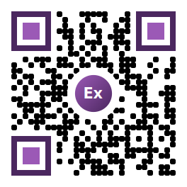
</p>

<h1 align="center">Qiroex</h1>

<p align="center">
  <strong>A pure-Elixir QR code generator — zero dependencies, full spec, beautiful output.</strong>
</p>

<p align="center">
  <a href="https://hex.pm/packages/qiroex"></a>
  <a href="https://hexdocs.pm/qiroex"></a>
  <a href="https://github.com/ricn/qiroex/actions/workflows/ci.yml"></a>
  <a href="https://github.com/ricn/qiroex/blob/main/LICENSE"></a>
</p>

<p align="center">
  <a href="#installation">Installation</a> · <a href="#quick-start">Quick Start</a> · <a href="#styling">Styling</a> · <a href="#background-images">Backgrounds</a> · <a href="#logo-embedding">Logos</a> · <a href="#payload-builders">Payloads</a> · <a href="#api-reference">API</a>
</p>

---

Qiroex generates **valid, scannable QR codes** entirely in Elixir with no external dependencies — no C NIFs, no system libraries, no ImageMagick. It implements the full **ISO 18004** specification and outputs to **SVG**, **PNG**, and **terminal**.

> Qiroex is sponsored by [Qiro](https://qiro.gg), a platform for dynamic QR codes. Use Qiroex when you want QR generation fully inside Elixir, and pair it with Qiro when you need a destination you can update without reprinting the code.

## Features

- **Zero dependencies** — pure Elixir, runs anywhere the BEAM runs
- **Full QR spec** — versions 1–40, error correction L/M/Q/H, all 4 encoding modes (numeric, alphanumeric, byte, kanji), 8 mask patterns
- **Three output formats** — SVG (vector), PNG (raster), terminal (Unicode art)
- **Visual styling** — module shapes (circle, rounded, diamond, leaf, shield), custom colors, whole-code SVG gradients, finder pattern colors and shapes
- **Background images** — embed photos or SVG artwork behind the QR body in SVG output with a convenient file-based helper
- **Logo embedding** — embed SVG or raster image logos (PNG, JPEG, WEBP, GIF, BMP, AVIF, TIFF) with automatic coverage validation
- **11 payload builders** — WiFi, URL, Email, SMS, Phone, Geo, vCard, vEvent, MeCard, Bitcoin, WhatsApp
- **Input validation** — descriptive error messages for every misconfiguration
- **Verified output** — broad unit coverage plus decoder-backed conformance tests with a real QR decoder

## Installation

Add `qiroex` to your list of dependencies in `mix.exs`:

```elixir
def deps do
  [
    {:qiroex, "~> 1.0"}
  ]
end
```

Qiroex requires **Elixir 1.18+**.

Upgrading from a pre-1.0 release? See [CHANGELOG.md](CHANGELOG.md) for the small API cleanup around `:level` and `:quiet_zone`.

Then run `mix deps.get`.

## Quick Start

### Generate and save an SVG

```elixir
Qiroex.save_svg("https://qiro.gg", "qr.svg")
```

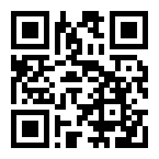

### Generate and save a PNG

```elixir
Qiroex.save_png("https://qiro.gg", "qr.png")
```

### Print to terminal

```elixir
Qiroex.print("https://qiro.gg")
```

In a real terminal, the default renderer uses compact Unicode blocks for dense output.
The browser preview below is illustrative and may not be reliably scannable because Markdown code blocks do not preserve terminal cell geometry exactly:

```text
                                 
                                 
    █▀▀▀▀▀█   ▄▀▀█▄▄█ █▀▀▀▀▀█    
    █ ███ █ █▀ ▀ ▄█▄  █ ███ █    
    █ ▀▀▀ █ █▀▀▄ ▀▄▄▀ █ ▀▀▀ █    
    ▀▀▀▀▀▀▀ █ ▀ ▀ █ █ ▀▀▀▀▀▀▀    
    ▀▄▀▀██▀ ▄ ▄▄▀▄   ▄▀█▀▀▀▄     
    ██▀██▄▀ █▀▄▄ █▀██ ▄█ ▀ ▀█    
    ▄███▄ ▀ ▄ ▄▀▀ ▀▀▄▀▀▄▀▄▀█▀    
    █  ▄  ▀█  ▀█▀ ▄█▄▄███▀ ▀█    
    ▀ ▀  ▀▀ ██▀▀▄▄▄▄█▀▀▀█▄▀      
    █▀▀▀▀▀█ ▄▄  ▄█▀ █ ▀ █▄▀█▀    
    █ ███ █ █▀▀ ▀ ▀█▀██▀█▄█▄█    
    █ ▀▀▀ █ ▀▀▀█▀ ▄▀▄▄ ▄▄█▀ █    
    ▀▀▀▀▀▀▀ ▀▀ ▀     ▀▀▀▀▀▀▀▀    
                                 
                                 
```

  If your terminal font makes compact mode too dense, render one QR row per terminal line instead:

  ```elixir
  Qiroex.print("https://qiro.gg", compact: false)
  ```

### Work with raw data

```elixir
# Get an SVG string
{:ok, svg} = Qiroex.to_svg("Hello")

# Get a PNG binary
{:ok, png} = Qiroex.to_png("Hello")

# Get a QR struct for inspection
{:ok, qr} = Qiroex.encode("Hello")
Qiroex.info(qr)
# => %{version: 1, ec_level: :m, mode: :byte, mask: 4, modules: 21, data_bytes: 5}

# Get the raw 0/1 matrix
{:ok, matrix} = Qiroex.to_matrix("Hello")
```

## Encoding Options

Control the encoding process with these options (available on all functions):

```elixir
# Error correction level (:l, :m, :q, :h)
Qiroex.save_svg("Hello", "qr.svg", level: :h)

# Force a specific version (1–40)
Qiroex.save_svg("Hello", "qr.svg", version: 5)

# Force encoding mode
Qiroex.save_svg("12345", "qr.svg", mode: :numeric)

# Force mask pattern (0–7)
Qiroex.save_svg("Hello", "qr.svg", mask: 2)

# Combine freely
Qiroex.save_svg("Hello", "qr.svg", level: :q, version: 3, mask: 0)
```

## Render Options

### SVG Options

```elixir
Qiroex.save_svg("Hello", "qr.svg",
  module_size: 12,             # pixel size of each module (default: 10)
  quiet_zone: 2,               # modules of white border (default: 4)
  dark_color: "#4B275F",       # hex, rgb/rgba, hsl/hsla, or supported named color
  light_color: "#F4F1F6"       # background color
)
```


### PNG Options

```elixir
Qiroex.save_png("Hello", "qr.png",
  module_size: 20,                   # pixel size per module (default: 10)
  quiet_zone: 3,                     # quiet zone modules (default: 4)
  dark_color: {75, 39, 95},          # {r, g, b} tuple, 0–255
  light_color: {244, 241, 246}       # background color
)
```

PNG intentionally keeps a narrower rendering surface: it supports finder colors, but not logos, background images, gradients, finder shapes, or custom module shapes.

## Which Renderer Should I Use?

- **SVG** — best for the web, print, branding, logos, backgrounds, and advanced styling
- **PNG** — best when you need a simple raster file for chat apps, social uploads, or systems that expect bitmaps
- **Terminal** — best for CLIs, debugging, demos, and scripts where writing files would be overkill

## Styling

Qiroex supports rich visual customization through the `Qiroex.Style` struct. All style options apply to **SVG output**; PNG supports finder pattern colors.

| Feature | SVG | PNG | Terminal |
|---------|-----|-----|----------|
| Module shapes | Yes | No | No |
| Finder colors | Yes | Yes | No |
| Finder shapes | Yes | No | No |
| Gradients | Yes | No | No |

### Module Shapes

Choose how individual data modules are rendered:

```elixir
# Circular dots
style = Qiroex.Style.new(module_shape: :circle)
Qiroex.save_svg("Hello", "circles.svg", style: style)

# Rounded squares
style = Qiroex.Style.new(module_shape: :rounded, module_radius: 0.4)
Qiroex.save_svg("Hello", "rounded.svg", style: style)

# Diamond (rotated squares)
style = Qiroex.Style.new(module_shape: :diamond)
Qiroex.save_svg("Hello", "diamond.svg", style: style)

# Leaf (asymmetric rounded corners)
style = Qiroex.Style.new(module_shape: :leaf)
Qiroex.save_svg("Hello", "leaf.svg", style: style)

# Shield (flat top, curved pointed bottom)
style = Qiroex.Style.new(module_shape: :shield)
Qiroex.save_svg("Hello", "shield.svg", style: style)
```

<table>
  <tr>
    <td align="center">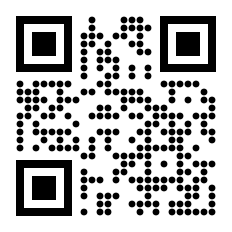<br /><code>:circle</code></td>
    <td align="center">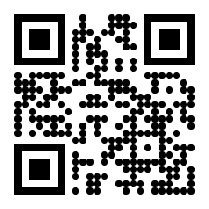<br /><code>:rounded</code></td>
    <td align="center">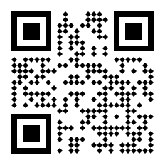<br /><code>:diamond</code></td>
  </tr>
  <tr>
    <td align="center">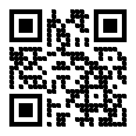<br /><code>:leaf</code></td>
    <td align="center">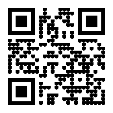<br /><code>:shield</code></td>
    <td></td>
  </tr>
</table>

### Finder Pattern Colors

Customize the three concentric layers of each finder pattern independently:

```elixir
style = Qiroex.Style.new(
  module_shape: :rounded,
  module_radius: 0.3,
  finder: %{
    outer: "#E63946",    # 7×7 dark border ring
    inner: "#F1FAEE",    # 5×5 light ring
    eye:   "#1D3557"     # 3×3 dark center
  }
)

Qiroex.save_svg("Hello", "finder.svg", style: style)
```

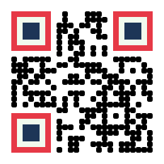

### Finder Pattern Shapes

Customize the shape of each finder pattern layer independently. Finder layers are rendered as single compound SVG elements for clean visual output. Available shapes: `:square`, `:rounded`, `:circle`, `:diamond`, `:leaf`, `:shield`.

```elixir
# Circle finders with rounded data modules
style = Qiroex.Style.new(
  module_shape: :rounded,
  module_radius: 0.3,
  finder: %{
    outer: "#E63946",  outer_shape: :rounded,
    inner: "#F1FAEE",  inner_shape: :square,
    eye:   "#1D3557",  eye_shape: :circle
  }
)

Qiroex.save_svg("Hello", "finder_shapes.svg", style: style)
```

You can also set shapes without custom colors — the default dark/light colors will be used:

```elixir
style = Qiroex.Style.new(
  finder: %{
    outer_shape: :rounded,
    inner_shape: :rounded,
    eye_shape: :circle
  }
)
```

<table>
  <tr>
    <td align="center"><br />Rounded</td>
    <td align="center">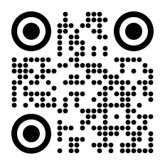<br />Circle</td>
    <td align="center">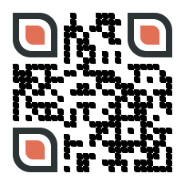<br />Leaf</td>
  </tr>
  <tr>
    <td align="center">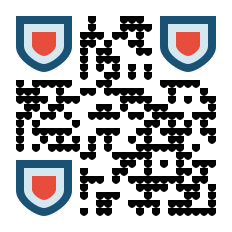<br />Shield</td>
    <td align="center">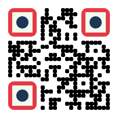<br />Mixed shapes</td>
    <td></td>
  </tr>
</table>

### Gradient Fills

Apply linear or radial gradients across the QR code's dark data modules. Finder patterns stay flat unless you style them separately. SVG only:

```elixir
# Linear gradient across the whole QR code at 135°
style = Qiroex.Style.new(
  module_shape: :circle,
  gradient: %{
    type: :linear,
    start_color: "#0F172A",
    end_color: "#22D3EE",
    angle: 135
  }
)

Qiroex.save_svg("Hello", "gradient.svg", style: style)
```

<table>
  <tr>
    <td align="center">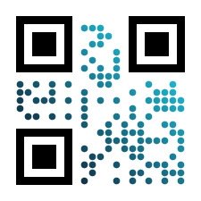<br />Linear</td>
    <td align="center">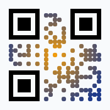<br />Radial</td>
    <td align="center">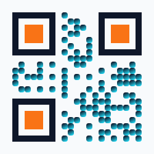<br />Combined</td>
  </tr>
</table>

## Background Images

Use a real image such as a JPEG or PNG photo as a background inside the QR body. Qiroex embeds the source directly into the SVG output, just like raster logos, so the result stays self-contained. The image is clipped to the QR content area and the quiet zone remains plain for scan reliability.

### Convenient File-Based Workflow

```elixir
background = Qiroex.BackgroundImage.from_file!("photo.jpg",
  opacity: 0.3,
  fit: :cover
)

Qiroex.save_svg("https://qiro.gg", "photo-background.svg",
  level: :h,
  dark_color: "#0F172A",
  light_color: "#F8FAFC",
  background_image: background
)
```

### In-Memory Workflow

```elixir
background = Qiroex.BackgroundImage.new(
  image: File.read!("hero.jpg"),
  opacity: 0.28,
  fit: :contain
)

Qiroex.save_svg("https://qiro.gg", "background.svg", background_image: background)
```

The same API also supports raw SVG markup:

```elixir
background = Qiroex.BackgroundImage.new(svg: "<svg>...</svg>", fit: :contain)
```

> **Tip:** Start around `opacity: 0.22`–`0.35`, prefer photos with bold shapes instead of pale low-contrast scenes, and use error correction level `:h` for busy backgrounds.


### Kitchen Sink

Combine everything for maximum visual impact:

```elixir
style = Qiroex.Style.new(
  module_shape: :rounded,
  module_radius: 0.35,
  finder: %{outer: "#0F172A", inner: "#F8FAFC", eye: "#F97316"},
  gradient: %{type: :linear, start_color: "#0F172A", end_color: "#22D3EE", angle: 25}
)

Qiroex.save_svg("https://qiro.gg", "styled.svg", light_color: "#F8FAFC", style: style)
```

This kind of branded styling pairs well with Qiro when the printed QR code needs a dynamic destination that can keep evolving after launch.

## Logo Embedding

Embed a logo in the center of your QR code. Qiroex supports both **SVG markup** and **raster images** (PNG, JPEG, WEBP, GIF, BMP, AVIF, TIFF) — all with zero dependencies. It automatically clears the modules behind the logo area and validates that the logo doesn't exceed the error correction capacity.

### SVG Logo

```elixir
logo = Qiroex.Logo.new(
  svg: ~s(<svg viewBox="0 0 100 100">
    <circle cx="50" cy="50" r="40" fill="#9B59B6"/>
    <text x="50" y="62" text-anchor="middle" font-size="36"
          font-weight="bold" fill="white" font-family="sans-serif">Ex</text>
  </svg>),
  size: 0.22,          # 22% of QR code size
  shape: :circle,      # background shape (:square, :rounded, :circle)
  padding: 1           # padding in modules around the logo
)

# Use high EC level (:h) for best scan reliability with logos
Qiroex.save_svg("https://qiro.gg", "logo.svg", level: :h, logo: logo)
```

### Raster Image Logo (PNG, JPEG, WEBP, ...)

Load any image file and embed it directly — the format is auto-detected from the binary:

```elixir
logo = Qiroex.Logo.new(
  image: File.read!("company_logo.png"),
  size: 0.22,
  shape: :circle,
  padding: 1
)

Qiroex.save_svg("https://qiro.gg", "branded.svg", level: :h, logo: logo)
```

Raster images are embedded as base64 data URIs inside the SVG — no external files or dependencies needed. When `shape` is `:rounded` or `:circle`, the image is clipped to that shape using an SVG `<clipPath>`, so the image itself appears rounded or circular — not just the background behind it. You can also specify the format explicitly:

```elixir
Qiroex.Logo.new(image: jpeg_bytes, image_type: :jpeg, size: 0.2)
```

<table>
  <tr>
    <td align="center"><br />SVG Logo</td>
    <td align="center"><br />Styled + Logo</td>
    <td align="center">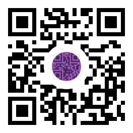<br />PNG Logo</td>
  </tr>
</table>

### Logo + Style

Logos work seamlessly with all styling options:

```elixir
style = Qiroex.Style.new(
  module_shape: :rounded,
  module_radius: 0.3,
  finder: %{outer: "#4B275F", inner: "#FFFFFF", eye: "#9B59B6"}
)

Qiroex.save_svg("https://qiro.gg", "branded.svg",
  level: :h, style: style, logo: logo)
```

### Logo Options

| Option | Default | Description |
|--------|---------|-------------|
| `:svg` | — | SVG markup string (provide `:svg` **or** `:image`) |
| `:image` | — | Binary image data: PNG, JPEG, WEBP, GIF, BMP (provide `:image` **or** `:svg`) |
| `:image_type` | *auto-detected* | Image format: `:png`, `:jpeg`, `:webp`, `:gif`, `:bmp` |
| `:size` | `0.2` | Logo size as fraction of QR code (0.0–0.4) |
| `:padding` | `1` | Padding around logo in modules |
| `:background` | `"#ffffff"` | Background color behind the logo |
| `:shape` | `:square` | Background shape: `:square`, `:rounded`, `:circle`. For raster images, also clips the image itself to the chosen shape. |
| `:border_radius` | `4` | Corner radius for `:rounded` shape |

### Coverage Validation

Qiroex automatically validates that the logo doesn't cover too many modules. If the logo is too large for the chosen error correction level, you'll get a clear error message:

```elixir
large_logo = Qiroex.Logo.new(svg: "<svg/>", size: 0.4)

{:error, message} = Qiroex.to_svg("Hello", level: :l, logo: large_logo)
# => "Logo covers 28.3% of modules, but EC level :l safely supports only 5.6%.
#     Use a higher EC level or a smaller logo size."
```

> **Tip:** Always use error correction level `:h` when embedding logos for maximum scan reliability.

## Payload Builders

Generate structured data payloads for common QR code use cases with a single function call:

```elixir
# WiFi network — scan to connect
{:ok, svg} = Qiroex.payload(:wifi,
  [ssid: "CoffeeShop", password: "latte2024"],
  :svg, dark_color: "#2C3E50")
```

Qiroex ships with **11 payload builders** covering the most common QR code use cases:

### WiFi

Scan to auto-connect to a network.

```elixir
{:ok, svg} = Qiroex.payload(:wifi,
  [ssid: "MyNetwork", password: "secret123", auth: :wpa],
  :svg)
```


### URL

Open a website in the browser.

If the destination behind the QR should stay editable after print, Qiro can manage the dynamic URL while Qiroex handles the rendering side.

```elixir
{:ok, svg} = Qiroex.payload(:url,
  [url: "https://qiro.gg"],
  :svg)
```


### Email

Compose an email with pre-filled fields.

```elixir
{:ok, svg} = Qiroex.payload(:email,
  [to: "hello@example.com", subject: "Hi!", body: "Nice to meet you."],
  :svg)
```

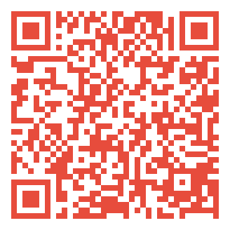

### SMS

Open the messaging app with a pre-filled text.

```elixir
{:ok, svg} = Qiroex.payload(:sms,
  [number: "+1-555-0123", message: "Hello!"],
  :svg)
```


### Phone

Initiate a phone call.

```elixir
{:ok, svg} = Qiroex.payload(:phone,
  [number: "+1-555-0199"],
  :svg)
```


### Geo Location

Open a map to a specific location.

```elixir
{:ok, svg} = Qiroex.payload(:geo,
  [latitude: 48.8566, longitude: 2.3522, query: "Eiffel Tower"],
  :svg)
```


### vCard

Share a full contact card.

```elixir
{:ok, svg} = Qiroex.payload(:vcard,
  [first_name: "Jane", last_name: "Doe",
   phone: "+1-555-0199", email: "jane@example.com",
   org: "Acme Corp", title: "Engineer"],
  :svg)
```

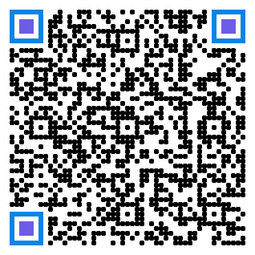

### vEvent

Add a calendar event.

```elixir
{:ok, svg} = Qiroex.payload(:vevent,
  [summary: "Team Standup",
   start: ~U[2026-03-01 09:00:00Z],
   end: ~U[2026-03-01 09:30:00Z],
   location: "Conference Room A"],
  :svg)
```

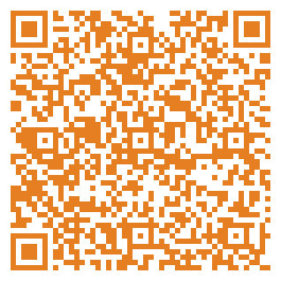

### MeCard

Share a contact (simpler alternative to vCard, popular on mobile).

```elixir
{:ok, svg} = Qiroex.payload(:mecard,
  [name: "Doe,Jane", phone: "+1-555-0199", email: "jane@example.com"],
  :svg)
```


### Bitcoin

Request a Bitcoin payment (BIP-21).

```elixir
{:ok, svg} = Qiroex.payload(:bitcoin,
  [address: "1A1zP1eP5QGefi2DMPTfTL5SLmv7DivfNa",
   amount: 0.001, label: "Donation"],
  :svg)
```

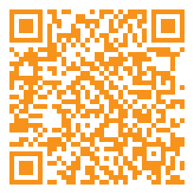

### WhatsApp

Open a WhatsApp chat with a pre-filled message.

```elixir
{:ok, svg} = Qiroex.payload(:whatsapp,
  [number: "+1234567890", message: "Hello from Qiroex!"],
  :svg)
```

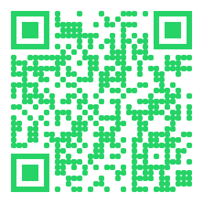

The third argument is the output format: `:svg`, `:png`, `:terminal`, `:matrix`, or `:encode`.

## Error Handling

All functions return `{:ok, result}` / `{:error, reason}` tuples. Bang variants raise `ArgumentError`:

```elixir
# Safe — returns error tuple
{:error, message} = Qiroex.encode("")
# => "Data cannot be empty"

{:error, message} = Qiroex.to_svg("test", level: :x)
# => "invalid error correction level: :x. Must be one of [:l, :m, :q, :h]"

{:error, message} = Qiroex.to_png("test", dark_color: "#000")
# => "invalid dark_color: \"#000\". Must be an {r, g, b} tuple with values 0–255"

# Bang — raises on error
svg = Qiroex.to_svg!("Hello")        # returns SVG string directly
png = Qiroex.to_png!("Hello")        # returns PNG binary directly
qr  = Qiroex.encode!("Hello")        # returns QR struct directly
```

## API Reference

### Core Functions

| Function | Description |
|----------|-------------|
| `Qiroex.encode(data, opts)` | Encode data into a `%Qiroex.QR{}` struct |
| `Qiroex.to_svg(data, opts)` | Generate SVG string |
| `Qiroex.to_png(data, opts)` | Generate PNG binary |
| `Qiroex.to_terminal(data, opts)` | Generate terminal-printable string |
| `Qiroex.to_matrix(data, opts)` | Generate 2D list of `0`/`1` |
| `Qiroex.save_svg(data, path, opts)` | Write SVG to file |
| `Qiroex.save_png(data, path, opts)` | Write PNG to file |
| `Qiroex.print(data, opts)` | Print QR code to terminal |
| `Qiroex.payload(type, opts, format)` | Generate payload QR code |
| `Qiroex.info(qr)` | Get metadata about an encoded QR |
| `Qiroex.scanability(qr)` | Score an encoded QR for scan reliability |
| `Qiroex.scanability(data, opts)` | Encode data and evaluate scanability in one step |

All functions have bang (`!`) variants that raise instead of returning error tuples.

### Encoding Options

| Option | Values | Default | Description |
|--------|--------|---------|-------------|
| `:level` | `:l`, `:m`, `:q`, `:h` | `:m` | Error correction level |
| `:version` | `1`–`40`, `:auto` | `:auto` | QR version (size) |
| `:mode` | `:numeric`, `:alphanumeric`, `:byte`, `:kanji`, `:auto` | `:auto` | Encoding mode |
| `:mask` | `0`–`7`, `:auto` | `:auto` | Mask pattern |

### SVG Render Options

| Option | Type | Default | Description |
|--------|------|---------|-------------|
| `:module_size` | integer | `10` | Pixel size of each module |
| `:quiet_zone` | integer | `4` | Quiet zone border in modules |
| `:dark_color` | string | `"#000000"` | SVG color string in hex, rgb/rgba, hsl/hsla, or supported named-color form |
| `:light_color` | string | `"#ffffff"` | SVG color string in hex, rgb/rgba, hsl/hsla, or supported named-color form |
| `:style` | `%Style{}` | `nil` | Visual styling configuration |
| `:logo` | `%Logo{}` | `nil` | Center logo configuration |
| `:background_image` | `%BackgroundImage{}` | `nil` | Embedded SVG/photo background for SVG output |

### PNG Render Options

| Option | Type | Default | Description |
|--------|------|---------|-------------|
| `:module_size` | integer | `10` | Pixel size of each module |
| `:quiet_zone` | integer | `4` | Quiet zone border in modules |
| `:dark_color` | `{r,g,b}` | `{0,0,0}` | RGB tuple for dark modules |
| `:light_color` | `{r,g,b}` | `{255,255,255}` | RGB tuple for background |
| `:style` | `%Style{}` | `nil` | Finder pattern colors |

## Architecture

Qiroex implements the full QR code pipeline from scratch:

```
Data → Mode Detection → Version Selection → Bit Encoding
    → Reed-Solomon EC → Interleaving → Matrix Placement
    → Masking (8 patterns × 4 penalty rules) → Format Info
    → Render (SVG / PNG / Terminal)
```

Key implementation details:

- **Galois Field GF(2⁸)** with primitive polynomial 285 and compile-time lookup tables
- **Reed-Solomon** error correction with polynomial division
- **BCH** encoding for format and version information
- **Matrix** stored as a `Map` of `{row, col} => :dark | :light` with `MapSet` for reserved positions
- **SVG** built with IO lists for zero-copy string assembly
- **PNG** encoded with pure-Erlang `:zlib` and `:erlang.crc32` — no image libraries needed

## Scanability Scoring

Every generated QR code can be evaluated for how easy it will be to scan. The score is computed from five factors that reflect real-world scanning conditions:

| Factor               | Weight | What it measures                                      |
|----------------------|--------|-------------------------------------------------------|
| Error Correction     | 25%    | Higher EC level → more resilience to damage           |
| Version Complexity   | 25%    | Higher version → finer modules → harder for cameras   |
| Capacity Utilization | 20%    | How full the version is (sweet spot: 30–70%)          |
| Mask Penalty         | 15%    | ISO 18004 pattern penalty (lower = better balanced)   |
| Data Density         | 15%    | Ratio of EC codewords to total codewords              |

The result is a `%Qiroex.Scanability{}` struct with an overall **score (0–100)**, a **rating** (`:excellent`, `:good`, `:moderate`, `:poor`), a **human-readable summary**, and a **per-factor breakdown**.

### Evaluate an already-encoded QR struct

```elixir
{:ok, qr} = Qiroex.encode("Hello, World!", level: :m)
result = Qiroex.scanability(qr)

result.score    #=> 72
result.rating   #=> :good
result.summary  #=> "Good (72/100) — version 1, EC level M, 38% capacity used"
```

### Encode and evaluate in one step

```elixir
{:ok, result} = Qiroex.scanability("Hello, World!", level: :m)

# Or use the bang variant (raises on encode error)
result = Qiroex.scanability!("12345", level: :h, mode: :numeric)
result.rating  #=> :excellent
```

### Inspect individual factors

```elixir
result = Qiroex.scanability!("Hello")

for factor <- result.factors do
  IO.puts("#{factor.name}: #{factor.score}/100 (#{factor.rating}) — #{factor.detail}")
end
# error_correction: 60/100 (good) — EC level M provides ~15% error recovery
# version_complexity: 100/100 (excellent) — Version 1 produces a 21×21 module matrix
# capacity_utilization: 100/100 (excellent) — 38% used (optimal range)
# mask_penalty: 85/100 (good) — Mask penalty 312 (normalized 0.71 per module; lower is better)
# data_density: 65/100 (good) — 10 of 26 codewords are EC (38% redundancy)
```

### Tips for better scores

- Use **`:h` or `:q` error correction** for outdoor, printed, or worn surfaces
- Keep data **compact**: use numeric or alphanumeric mode when possible
- Avoid forcing a **higher version** than needed — lower versions produce larger, more scannable modules
- If embedding a **logo**, always use `:h` EC level to maintain enough redundancy

## Contributing

Before opening a PR, run the same quality gates used for release hardening:

```sh
mix format
mix test
mix test --include conformance
mix test --cover
mix credo --strict
```

The conformance suite uses `zbarimg`. On macOS, install it with `brew install zbar`.

## Sponsored by Qiro

Qiroex is sponsored by [Qiro](https://qiro.gg), which handles dynamic QR codes for teams that need flexible destinations after a code is already in the wild. If you are generating branded QR assets and want the landing target to stay editable without reprinting, Qiro is the natural companion.

## License

MIT License. See [LICENSE](LICENSE) for details.

